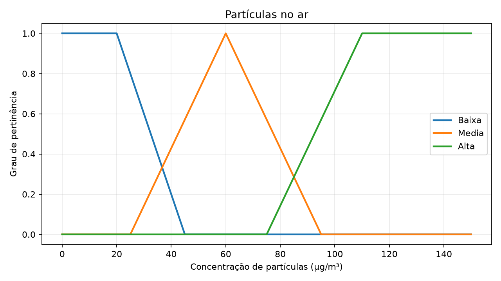
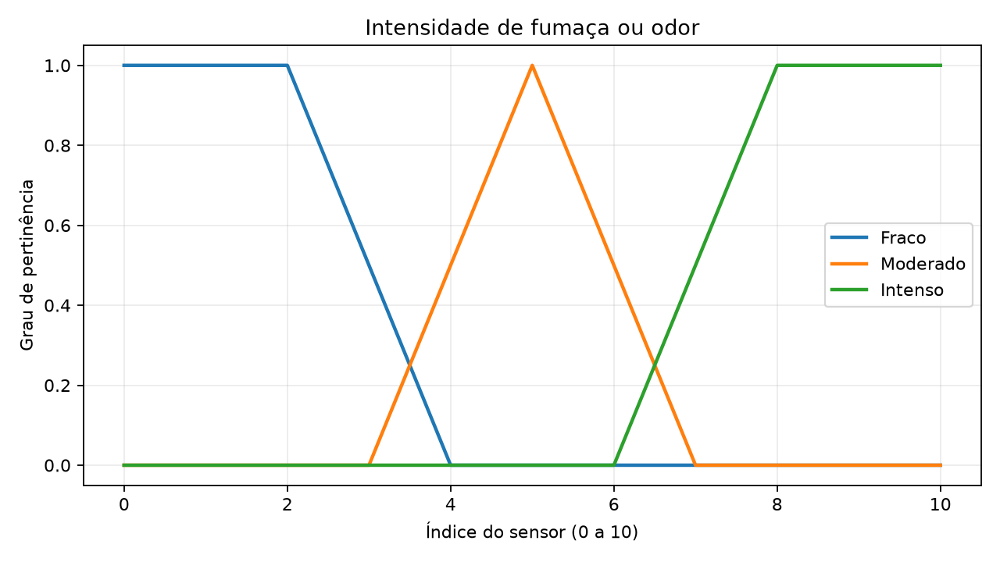
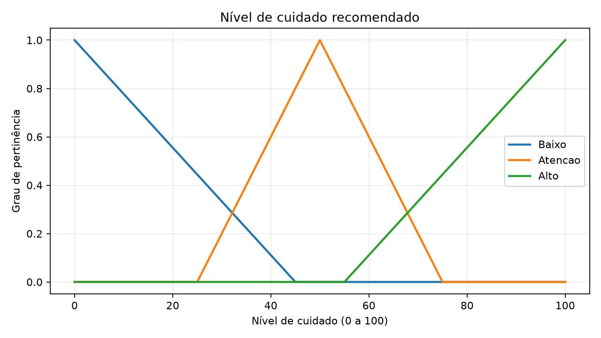
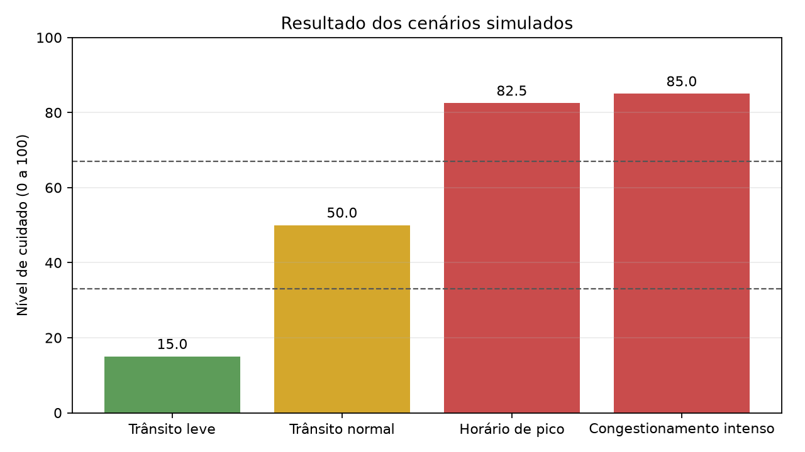

# Resultados Aula 09 - Lógica Fuzzy

## 0. Execução dos laboratórios fornecidos

No `lab01_aula09.py`, foram testadas cinco temperaturas. Os resultados foram 17% de velocidade para 10 °C, 44% para 20 °C, 50% para 25 °C, 56% para 30 °C e 83% para 38 °C. O ventilador não muda de forma brusca: perto das regiões de transição, uma temperatura pode pertencer parcialmente a dois conjuntos fuzzy e a velocidade fica intermediária.

No `lab02_aula09.py`, usei as entradas padrão do laboratório: serviço igual a 7 e comida igual a 3. A gorjeta sugerida foi de 12,5%. Nesse caso aparecem ao mesmo tempo regras para uma gorjeta baixa, média e alta, porque as notas pertencem parcialmente a mais de um conjunto. Depois da agregação das regras, a defuzzificação retorna uma recomendação única.

## 1. Problema escolhido

Escolhi criar um sistema de alerta para a qualidade do ar no meu caminho para o trabalho, por volta das 8h. O trecho considerado fica na Marginal de São Paulo, perto de Pinheiros, onde o trânsito costuma estar intenso. A ideia não é indicar uma rota alternativa, mas informar o nível de cuidado para quem está passando pela região. Escolhi esse tema porque, no horário de pico, a sensação mais perceptível é de ar pesado.

O problema é adequado para lógica fuzzy porque não existe uma linha exata entre ar bom e ar ruim. Uma quantidade intermediária de partículas ou uma fumaça moderada já pode justificar atenção. As leituras usadas nos testes são cenários simulados para representar o trajeto; não são medições oficiais.

## 2. Modelagem das variáveis

| Variável | Tipo | Universo de discurso | Termos linguísticos |
| --- | --- | --- | --- |
| Partículas no ar | Entrada | 0 a 150 µg/m³ | baixa, média, alta |
| Fumaça/odor | Entrada | índice de 0 a 10 | fraco, moderado, intenso |
| Nível de cuidado | Saída | 0 a 100 | baixo, atenção, alto |

O intervalo de partículas foi limitado a 150 µg/m³ porque ele permite representar desde uma situação de trânsito leve até um congestionamento com ar visivelmente mais pesado. Para fumaça/odor, foi usado um índice de 0 a 10 por ser fácil de interpretar: 0 significa ausência percebida e 10, intensidade muito forte. A saída de 0 a 100 transforma a recomendação em um valor numérico antes da classificação final.

Usei trapézios nos extremos porque as situações claramente baixas ou altas podem permanecer estáveis por uma faixa de valores. Os triângulos ficaram nos níveis intermediários, onde há maior transição e incerteza. Essa sobreposição permite que uma leitura, por exemplo, seja parcialmente média e parcialmente alta.

## 3. Base de regras

1. Se as partículas estão **baixas E** a fumaça/odor é **fraca**, então o cuidado é **baixo**.
2. Se as partículas estão **baixas E** a fumaça/odor é **moderada**, então o cuidado é de **atenção**.
3. Se as partículas estão **médias E** a fumaça/odor é **fraca**, então o cuidado é de **atenção**.
4. Se as partículas estão **médias E** a fumaça/odor é **moderada**, então o cuidado é de **atenção**.
5. Se as partículas estão **altas E** a fumaça/odor é **fraca**, então o cuidado é de **atenção**.
6. Se as partículas estão **médias E** a fumaça/odor é **intensa**, então o cuidado é **alto**.
7. Se as partículas estão **altas E** a fumaça/odor é **moderada**, então o cuidado é **alto**.
8. Se as partículas estão **altas OU** a fumaça/odor é **intensa**, então o cuidado é **alto**.

## 4. Gráficos das funções de pertinência

Os gráficos foram gerados pelo arquivo `lab03_qualidade_ar.py`.

### Partículas no ar



### Fumaça ou odor



### Nível de cuidado



## 5. Testes realizados

| Situação simulada | Partículas (µg/m³) | Fumaça/odor | Saída do sistema | Resultado esperado |
| --- | ---: | ---: | --- | --- |
| Trânsito leve | 15 | 1,5 | 15,0 - Baixo | Baixo |
| Trânsito normal | 45 | 4 | 50,0 - Atenção | Atenção |
| Horário de pico | 80 | 7 | 82,5 - Alto | Alto |
| Congestionamento intenso | 130 | 9 | 85,0 - Alto | Alto |



## 6. Interpretação

A lógica fuzzy não toma a decisão apenas com um corte fixo. Em vez disso, cada entrada pode pertencer parcialmente a mais de um conjunto, como média e alta ao mesmo tempo. As regras combinam esses graus de pertinência e, depois, o sistema calcula um único nível de cuidado. Assim, o aviso muda de forma gradual quando o ar fica mais pesado, o que representa melhor uma situação real de trânsito.

## 7. Como executar

```powershell
python -m pip install -r requirements.txt
python lab03_qualidade_ar.py
```

O código imprime os quatro resultados no terminal e salva as imagens na pasta `imagens_aula09`.
